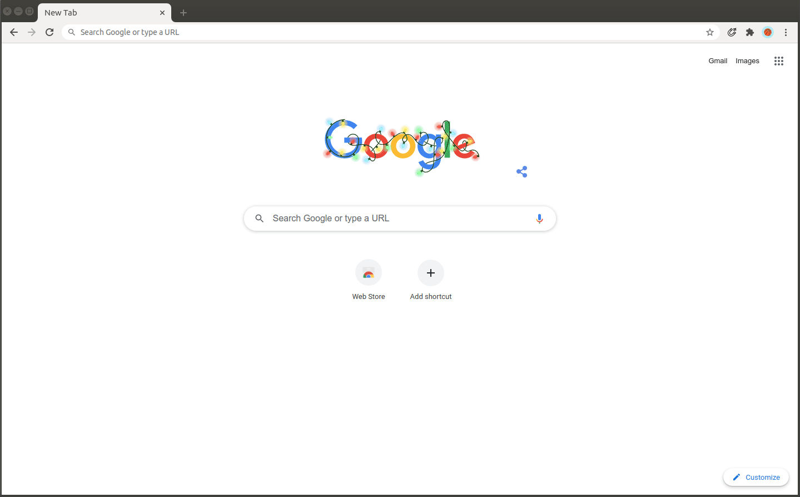

# find-magnet-extension

A browser extension to look for magnet links in each page

<a href="https://addons.mozilla.org/en-US/firefox/addon/find-magnet"></a>

 [studiojms](https://patreon.com/studiojms)

### Installing

#### Firefox

If you use firefox, you can find it in the Add-ons gallery:

<a href="https://addons.mozilla.org/en-US/firefox/addon/find-magnet"></a>

### Manual Installation (chrome and other browsers)

#### Example




#### Running

Navigate to the project directory and install the dependencies.

```
$ npm install
```

or

```
$ yarn
```

To build the extension, and rebuild it when the files are changed, run

```
$ npm run dev
```

or

```
$ yarn dev
```


#### How to test

After the project has been built (`npm run build` | `yarn build`), a directory named `dist` has been created. You have to add this directory to your Chrome browser:

1. Open Chrome.
2. Navigate to `chrome://extensions`.
3. Enable _Developer mode_.
4. Click _Load unpacked_.
5. Select the `dist` directory.


#### Obs

There is an already built version, that can be downloaded [here](find-magnet.zip?raw=true)
